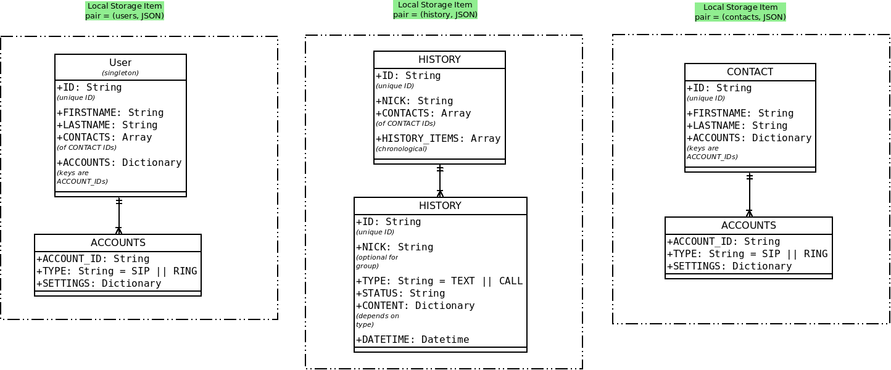

# Introduction

The requirements specifies to use the storage associated and supported by major browsers such as Firefox, Chrome and Opera to make it possible to run the Ring API client directly in a browser as a WebExtension.

# Implemented

## Local Storage (HTML5)

It is light in code, mature and supported by almost every web browser.

Local Storage is based on *(key, value)* pair where the value is a JSON string. This data persists after closing a browser. It's handled by the browser and each WebExtension has its own localStorage. On GNU / Linux the data is stored in SQLite format under:

        ./config/google-chrome/Default/LocalStorage/chrome_extension_ADDON_HASH_0.localstorage

You can get the *ADDON_HASH* by looking on the URL of your Addon which looks like:

    chrome-extensions://ADDON_HASH/

To see the data, you can open it with *sqlite3* and write *.dump*. This demonstrates that the localStorage data is isolated by a browser for a certain user using a certain addon. Therefore, it is not mandatory to segment the data structure for a particular user. By doing so, we increase performance by reducing lookups into values that we have to parse from JSON strings. Moreover, we reduce the possible data collisions, we isolate the sensitive data such (history) that can be quickly erased, and we make it very simple to backup contacts using a simple single JSON string.

Here is the data model for the LocalStorage:

It is trivial to understand that the Ring project is a Peer-to-peer distributed communication software which uses SIP (with a central server) and SIP over OpenDHT network (without center server).

It means that each user or device (it could be an IoT object) would have many SIP and / or RING accounts that can be used as the contact method. However, it wouldn't be User Friendly to create a separate contact for each contact method. Instead, we would group the history using different accounts for the same contact(s) and then display on demand which account was used. Also, contacts are separated from the User singleton because as well as the user they need methods of contact (accounts). Otherwise, a lookup for a user / contact accounts would have to parse two tables (user / contact_methods) and search for the right persons for every operations involving this data (i.e. updates / imports / exports etc.). This and the fact that is not a relational database optimized for fast lookups justifies this choice.

Conversation history for a text or call could be between two or more persons if it's a group chat / conference. Therefore, there is no need to nest history under contacts.

# Alternatives

## Web SQL Database

> Beware. This specification is no longer in active maintenance and the Web Applications Working Group does not intend to maintain it further. -- [w3.org](https://dev.w3.org/html5/webdatabase/)

## IndexedDB

More explorations needed but seems heavy in code [w3.org](https://www.w3.org/TR/IndexedDB/)

## Chrome Storage

This API has been optimized to meet the specific storage needs of extensions. It provides the same storage capabilities as the localStorage API with the following key differences:

* It's asynchronous with bulk read and write operations, and therefore faster than the blocking and serial localStorage API.

* User data can be stored as objects (the localStorage API stores data in strings).

### Cons

1. Dead Objects with modal windows

    It happened when the chrome storage generated Dead Objects if the modal window was closed before the asynchronous operation was completed.

2. Incompatible with native LocalStorage

        localStorage.setItem('a', 'b');
        localStorage.getItem('a');
        //"b"

        chrome.storage.local.get('a', function(item){console.log(item)})
        //Object {}

        chrome.storage.local.set('a', 'b')
        chrome.storage.local.get('a', function(item){console.log(item)})
        //Object {a: "b"}
